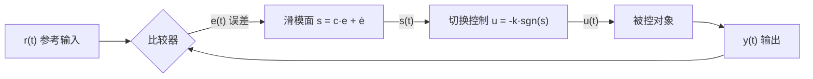

```mermaid
flowchart LR
    R["r(t) 参考输入"] --> E{比较器}
    Y["y(t) 输出"] --> E
    E -->|"e(t) 误差"| S["滑模面 s = c·e + ė"]
    S -->|"s(t)"| C["切换控制 u = -k·sgn(s)"]
    C -->|"u(t)"| P["被控对象"]
    P --> Y
```
